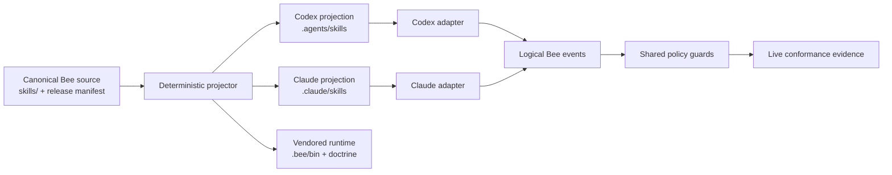

# Spec: Làm cứng Bee harness theo kiến trúc Codex-native

**Trạng thái:** Approved — §15 D-01..D-14 locked (owner 2026-07-15, decision `ed0b2920`); evidence table
2.1 re-audited 2026-07-15 (12/15 confirmed verbatim, E-11/E-13 corrected in-doc, E-01 chờ live probe);
implementation-ready theo slice plan §14  
**Ngày:** 2026-07-15 (audit gốc) · 2026-07-15 (re-audit + decision lock)  
**Baseline được quan sát:** runtime/vendored Bee `0.1.44`; projection Codex đang được nạp từ
`.agents/skills` tự nhận là `0.1.43`  
**Phạm vi:** source identity, skill projection, installer/update, runtime adapter, guard coverage,
subagent contract, verification và migration cho Codex + Claude Code

## 1. Kết luận điều hành

Việc xoá các Bee skill cũ khỏi global Codex đã giải quyết đúng một lỗi: **skill shadowing**. Một task
Codex mới hiện chỉ nhìn thấy các skill Bee theo project tại `.agents/skills`, có namespace
`bee:bee-*`. Vì vậy, vấn đề còn lại không phải đơn thuần là “Codex đọc prompt kém hơn Claude Code”.

Bee hiện còn ba khoảng hở kiến trúc:

1. **Source/distribution split-brain:** Codex đang thực thi skill projection `0.1.43`, trong khi
   `.bee` và onboarding ledger báo `0.1.44`, `drift: false`. Chạy dry-run từ chính skill Codex lại
   đề xuất chép hai library cũ vào runtime mới. Nếu apply, luồng update có thể trở thành downgrade.
2. **Enforcement vẫn mang hình dạng Claude Code:** installer, hook catalog và tài liệu orchestration
   dùng tên tool/lifecycle của Claude. Codex hiện có tool composition và subagent schema khác; prose
   có thể được đọc đúng nhưng guard không nhất thiết thấy được hành động thật.
3. **Verification dừng quá sớm:** unit/fixture tests có thể xanh khi adapter không được runtime gọi,
   khi fixture thiếu transitive module, hoặc khi fail-open nuốt crash. Chưa có một release gate nối
   từ canonical source đến skill root mà Codex thật nhìn thấy và một deny thật trong trusted session.

Thiết kế đích là một pipeline có một chiều và có bằng chứng:



Nguyên tắc cốt lõi: **chia sẻ policy, không giả vờ hai runtime có cùng API**. `.agents/skills` và
`.claude/skills` là các projection được tạo từ cùng canonical source; adapter của từng host chuyển
event thật thành event logic chung; release chỉ xanh khi projection, adapter và hành vi live đều có
bằng chứng.

## 2. Bằng chứng hiện trạng

### 2.1 Những gì đã được xác nhận

| ID | Bằng chứng | Kết luận |
|---|---|---|
| E-01 | Một task mới chạy `codex debug prompt-input` chỉ liệt kê Bee từ project `.agents/skills`; không còn Bee dưới `~/.codex/skills`. | Global shadowing trên máy hiện tại đã được loại bỏ. Không cần xoá thêm global path. |
| E-02 | `node .bee/bin/bee.mjs status --json` báo onboarding/runtime `0.1.44`, `drift: false`. | Ledger hiện tin runtime đang đồng bộ. |
| E-03 | `node .agents/skills/bee-hive/scripts/onboard_bee.mjs --repo-root <repo> --json` báo source `0.1.43`, `changes_needed`, gồm `copy_lib` cho `command-registry.mjs`, `state.mjs` và `write_onboarding`. | Active Codex skill source cũ hơn runtime; E-02 là false green. Không được apply dry-run này. |
| E-04 | `scripts/install.sh:227-231` và `scripts/install.ps1:201-205` chỉ truyền repo-hook option cho Claude hoặc cả hai runtime, không gồm Codex-only. | Fresh Codex-only install có skill/doctrine nhưng có thể thiếu lifecycle guard. |
| E-05 | `skills/bee-hive/scripts/onboard_bee.mjs:851-895` dùng blanket self-skip trong source repo; `skills/bee-hive/scripts/test_onboard_bee.mjs:1666-1705` còn pin hành vi không tạo projection. | Source checkout không tự sửa các projection riêng biệt dù Codex thực sự đọc projection đó. |
| E-06 | `skills/bee-swarming/references/swarming-reference.md:17-22` mô tả `spawn_agent(agent_type=..., fork_context=false)` và “re-spawn” để tiếp tục. | Contract này không khớp collaboration API của Codex hiện tại. |
| E-07 | Hook vocabulary hiện tập trung vào `Edit`, `Write`, `MultiEdit`, `Bash`, `Read`, `Glob`, `Grep`, `Agent` và `Task`. | Coverage phù hợp Claude Code không tự chứng minh coverage cho Codex tool wrapper/nested tools. |
| E-08 | `.agents/` và `.claude/skills/` đang là generated projection nhưng chưa được quản lý như release artifact bắt buộc trong checkout này. | Một release có thể cập nhật canonical/runtime mà bỏ quên projection active. |
| E-09 | Canonical/runtime/plugin manifests đều là `0.1.44`, nhưng cả `.agents/.../state.mjs:11` và `.claude/.../state.mjs:11` là `0.1.43`; `git ls-files .agents .claude/skills` không trả file nào. | Cả hai projection stale và untracked; clean clone của Bee source có thể không discover Bee project-local. |
| E-10 | `scripts/install.sh:160-190` và `scripts/install.ps1:124-165` xoá/copy global skill trước khi onboarding preflight chạy ở các đoạn `227-250` và `201-218`. | Raw installer copy bypass source identity, downgrade refusal, namespace mirror và all-target zero-mutation. |
| E-11 | Manifest parity chỉ hash bytes (`onboard_bee.mjs:368-399,575-576`); projection write không preserve mode (`900-905,977-988`). Canonical `templates/statusline/statusline-command.sh` là `100755`, hai projection là `0644`. | “Content parity” hiện có thể xanh trong khi executable metadata sai. |
| E-12 | Live Codex `0.144.4` expose outer `functions.exec` và nested `tools.exec_command`/`tools.apply_patch`; catalog chỉ match Claude-style names (`hooks/catalog.mjs:117-128`, `.codex/hooks.json:26-35`). | Mechanical coverage của nested Codex actions chưa được chứng minh. |
| E-13 | Privacy guard chỉ đi qua exact `Read`, `Glob`, `Grep` (`bee-write-guard.mjs:312-323`); shell/nested reads như `cat .env` rơi vào nhánh Bash (`:324-328,385-394`) → `extractBashTargets`+`checkWrite` (gate/reservation), KHÔNG qua secret-pattern/privacy check. | Secret protection chưa bao phủ read path shell/nested mà Codex đang dùng: `cat .env` không bị chặn bởi privacy branch. |
| E-14 | Reservation identity không biết live collaboration agent id/task path và cho qua khi thiếu identity (`hooks/bee-write-guard.mjs:68-84`, `.bee/bin/lib/guards.mjs:234-251`). | Reservation có thể fail open trong Codex swarm. |
| E-15 | `.bee/config.json:12-15` chưa chạy `skills/bee-hive/templates/tests/test_bee_cli.mjs` trong verify bắt buộc. | Release có thể xanh dù registry example/handler projection đỏ. |

### 2.2 Kết quả verification tại thời điểm audit

**Re-audit 2026-07-15 (evidence table 2.1):** 12/15 claim confirmed nguyên văn tại file:line hiện tại;
`E-11` giữ substance (mode `0644` vs canonical `100755`) nhưng path đã đổi thành
`templates/statusline/statusline-command.sh`; `E-13` được làm rõ (shell read rơi vào write/reservation
guard, không phải "vô guard" hoàn toàn, nhưng vẫn bỏ qua privacy/secret-pattern check); `E-01` chờ
live probe trong fresh Codex task (`codex 0.144.4` đã có trên PATH). Không claim nào bị bác bỏ.

**Cập nhật baseline verify 2026-07-15 (re-run):** hiện `commands.verify` chạy **exit 0** —
`test_lib`, `test_onboard_bee`, `test_portable_paths`, `test_model_guard`, `test_write_guard`,
`test_hook_contracts` (141 rows, 0 skipped, 0 failing) đều xanh. Row `route-plugin-census` từng đỏ
tại audit gốc nay parse được (`1 entry`, không có bee plugin). Điều này **không** làm mất E-15:
`test_bee_cli.mjs` vẫn chưa nằm trong mandatory verify, nên yêu cầu TEST-11/D-14 và Slice 0 giữ nguyên.

- Verify hiện hành đã chạy hết ngày 2026-07-15 và **exit 1**: core library `293/0`, onboarding
  `failures: 0, skipped: 0`, portable paths `653` paths safe, model guard và write guard đều
  `ALL PASS`; hook-contract chạy `141` rows và fail đúng `1` row.
- Row đỏ là `route-plugin-census`: `codex plugin list --json` không parse được vì configured
  marketplace snapshot `openai-primary-runtime` không chứa supported manifest. Điều này chưa chứng
  minh Bee hook bị sai, nhưng nó làm **exactly-one active/trusted Codex source chưa thể được chứng
  minh**, nên release readiness vẫn đỏ.
- `test_bee_cli.mjs` được chạy riêng và xanh `121/0`. Kết quả xanh này không xoá E-15: suite vẫn phải
  nằm trong mandatory verify để một release tương lai không quên chạy nó.
- Onboarding suite hiện pass các frozen rows: self-onboard report `self_skip`, không copy vào
  `.agents/.claude`, rồi recheck `up_to_date`. Đây là test đang pin chính defect E-03/E-09; cần đổi
  expectation bằng regression-first change, không dùng “suite đang xanh” để bác bỏ source inversion.

### 2.3 Phân loại vấn đề

| Severity | Vấn đề | Hậu quả |
|---|---|---|
| P0 | Active source `0.1.43` có thể ghi đè runtime `0.1.44`, trong khi status báo không drift. | Silent downgrade hoặc contract/runtime không tương thích. |
| P1 | Codex-only install không mặc định nối repo hooks/adapter. | Người dùng tưởng có guard nhưng thực tế chủ yếu dựa vào prose. |
| P1 | Tài liệu spawn/follow-up dùng schema không tồn tại trên Codex hiện tại. | Swarm/review không chạy, hoặc vô tình fork cả lịch sử. |
| P1 | Test handler trực tiếp không chứng minh runtime gọi đúng handler. | False confidence; denial có thể không bao giờ được thực thi. |
| P1 | Raw shell/PowerShell global copy chạy trước hardened preflight. | Một target bị overwrite trước khi downgrade/source ambiguity được phát hiện. |
| P1 | Privacy, reservation và outside-root handling không có Codex identity/path coverage đầy đủ. | Secret read hoặc mutation có thể lọt qua nhánh fail-open. |
| P2 | Release version không hiện rõ trong skill metadata/tree manifest. | Khó xác định task đang chạy skill release nào. |
| P2 | Sync theo bytes nhưng chưa coi executable mode là parity. | Script có thể giống nội dung nhưng mất quyền chạy. |
| P2 | Task đã mở giữ startup skill catalog cũ. | Update đúng vẫn không có hiệu lực cho task hiện tại cho đến khi tạo task mới. |
| P2 | `--runtime` chỉ lọc một phần raw copy/hook pass-through, trong khi onboarding vẫn render cả hai skill roots. | Filesystem outcome không khớp CLI claim. |

## 3. Khác biệt Codex và Claude Code mà Bee phải mô hình hoá

| Khía cạnh | Claude Code | Codex hiện tại | Hệ quả thiết kế |
|---|---|---|---|
| Project skill root | `.claude/skills` | `.agents/skills` | Phải materialize hai cây thật; không dùng symlink làm mặc định Windows. |
| Discovery lifetime | Theo session/runtime của Claude | Skill catalog được chốt ở startup task | Update phải yêu cầu fresh task để kiểm chứng. |
| Write tools | Tool names trực tiếp như `Edit`, `Write`, `Bash` | Có outer `functions.exec`, nested `tools.apply_patch`/`tools.exec_command` | Không thể map bằng cách đổi vài tên string; cần adapter/capability probe. |
| Agent spawn | Claude `Agent`/`Task` contract | `collaboration.spawn_agent({task_name,message,fork_turns})` | Tài liệu và guard cần schema theo runtime. |
| Agent continuation | Host-specific | `followup_task({target,message})`; `send_message` không trigger turn | Không mô tả continuation là “re-spawn”. |
| Isolation | Claude option riêng | `fork_turns: "none"` | Reviewer/I/O worker phải dùng đúng transport này. |
| Model selection | Có thể có model param | Collaboration schema hiện không expose model | Tier marker là routing intent; không được tuyên bố model đã chọn nếu host không chứng minh. |
| Hooks | Event/tool vocabulary Claude-native | Coverage phụ thuộc capability Codex thực tế cung cấp | Installer phải báo enforcement grade thay vì mặc định “protected”. |

Mục tiêu không phải làm Codex giả làm Claude Code. Mục tiêu là giữ cùng business invariant ở lớp
policy, trong khi adapter và capability report trung thực với từng host.

## 4. Mục tiêu, ngoài phạm vi và từ vựng

### 4.1 Mục tiêu

1. Một release Bee có đúng một canonical identity và mọi artifact active có thể chứng minh mình cùng
   identity đó.
2. Fresh Codex task luôn nạp project-local skill projection đúng release; global legacy không thể
   shadow mà không bị phát hiện.
3. Onboarding/update không bao giờ downgrade hoặc partial-update do source discovery sai.
4. Guard nhận event logic thống nhất nhưng adapter theo đúng tool schema của host.
5. Mức bảo vệ được báo là `mechanical`, `partial` hoặc `advisory` dựa trên probe thật.
6. Swarm/review trên Codex dùng đúng spawn, isolation, tier transport và continuation contract.
7. Release evidence đi từ unit đến clean install và trusted live session; fail-open không thể giả xanh.
8. Windows PowerShell 5.1, WSL, Linux, clean checkout và no-git behavior có contract rõ ràng.

### 4.2 Ngoài phạm vi

- Không chuẩn hoá API của Codex và Claude Code thành cùng raw schema.
- Không làm task Codex đang mở hot-reload skill catalog.
- Không tự động xoá global skill của người dùng.
- Không xây marketplace/plugin distribution mới.
- Không thay đổi business workflow/gates của Bee ngoài phần cần để adapter thực thi đúng invariant.
- Không cam kết một model cụ thể cho collaboration subagent khi host không expose model selector.

### 4.3 Từ vựng

| Thuật ngữ | Nghĩa chuẩn |
|---|---|
| Canonical source | Cây `skills/` trong Bee source package được release manifest xác nhận. |
| Projection | Bản materialized dành cho một host: `.agents/skills/bee-*` hoặc `.claude/skills/bee-*`. |
| Vendored runtime | `.bee/bin`, `.bee/bin/lib`, doctrine/config được host repo lưu cùng project. |
| Source identity | `source_kind + bee_release + tree_digest + realpath`. |
| Runtime adapter | Thành phần chuyển raw host event/tool call thành logical Bee event. |
| Enforcement grade | `mechanical`, `partial`, `advisory` hoặc `unsupported`. |
| Live conformance | Bằng chứng runtime thật discover đúng skill và guard một hành vi thật. |
| Coverage gap | Logical invariant chưa có interception point đáng tin cậy trên host hiện tại. |

## 5. Kiến trúc đích

### 5.1 Các lớp bắt buộc

1. **Canonical layer** — `skills/`, templates và shared runtime source.
2. **Release manifest layer** — identity, digest, file inventory và mode của toàn release.
3. **Projection layer** — generator materialize `.agents/skills` và `.claude/skills`.
4. **Vendored runtime layer** — `.bee` helpers/state engine dùng trong host repo.
5. **Host adapter layer** — Codex/Claude raw events → logical events.
6. **Policy layer** — privacy, scout, intake/gate, reservation, tier transport, lifecycle.
7. **Evidence layer** — status, diagnostics, fixture tests, live probes và release report.

Raw host payload không được đi thẳng vào shared guard. Shared guard chỉ nhận logical event có schema
được version hoá. Adapter không được chứa business decisions ngoài việc parse/normalize/capability
classification.

### 5.2 Logical event schema tối thiểu

```text
session.start        { host, cwd, fresh, capabilities }
session.resume       { host, cwd, compaction, handoff_kind? }
session.postcompact  { host, cwd, session_id, rehydrated }
file.read            { host, tool, paths[], intent? }
file.write           { host, tool, paths[], operation, agent_name? }
shell.exec           { host, tool, command, cwd, env_keys[] }
agent.spawn          { host, tool, task_name, prompt, isolation, tier_transport }
agent.start          { host, agent_id, canonical_task, task_name, binding }
agent.followup       { host, tool, target, prompt, tier_transport }
agent.stop           { host, agent_id, canonical_task, outcome }
session.finish       { host, cwd, claimed_work, reservations }
```

Mọi event có `schema_version`, `runtime_version`, `adapter_version`, `source`, `session_id`,
`raw_tool_name`, `nested_path`, `agent_id`/`task_name` khi có và `correlation_id`. Secret content không
được copy vào log; log chỉ lưu path classification, canonical family, verdict và reason code.

## 6. Yêu cầu chuẩn hoá source và distribution

### 6.1 Release identity

- **DIST-01 — Một release manifest duy nhất.** Canonical package MUST có manifest machine-readable
  chứa tối thiểu `schema_version`, `bee_release`, `source_commit` (nếu có), `files[]` với relative
  path, SHA-256, POSIX mode và role.
- **DIST-02 — Release khác contract metadata.** `metadata.version: "0.1"` trong SKILL frontmatter
  không được dùng làm Bee release. Manifest MUST dùng trường riêng `bee_release`.
- **DIST-03 — Manifest đi cùng mọi artifact.** Hai projection và vendored runtime MUST mang release
  identity/digest có thể đối chiếu về cùng canonical manifest.
- **DIST-04 — Status dùng cùng detector với updater.** `bee status` và onboarding plan MUST gọi chung
  một source/version/parity detector. Không cho phép status `drift:false` khi plan báo
  `changes_needed` hoặc downgrade risk.
- **DIST-05 — Release tuple strict equality.** `BEE_VERSION`, `.claude-plugin/plugin.json`,
  `.codex-plugin/plugin.json`, tag/version publish, runtime và generated projections MUST cùng một
  strict-semver tuple trước release. Sparse checkout/package source MUST mang đủ cả hai manifests để
  validator kiểm tra được điều này.

### 6.2 Source classification

- **SRC-01 — Không đoán source từ path gần nhất.** Source resolver MUST phân loại rõ:
  `source_checkout`, `project_projection`, `plugin_package`, `legacy_global`, `unknown`.
- **SRC-02 — Source checkout ưu tiên canonical.** Khi repo có canonical marker và
  `skills/bee-hive`, launcher chạy từ `.agents`/`.claude` MUST resolve về canonical `skills/`, không
  tự coi projection cũ là source.
- **SRC-03 — Installed host dùng package chứa launcher.** Khi không ở source checkout, một complete
  manifested project snapshot có thể là source cho vendored runtime và projection cùng repo, nhưng
  MUST NOT dùng quyền đó để cài global/plugin target.
- **SRC-04 — Unknown fail closed trước mutation.** Thiếu manifest, manifest không parse được, tree
  digest sai hoặc source kind mơ hồ MUST dừng toàn apply, exit nonzero và zero mutation.
- **SRC-05 — Self-skip chỉ theo realpath identity.** Chỉ skip khi source tree và đúng target tree là
  cùng realpath/inode. Repo chứa target không phải lý do blanket skip các target khác.
- **SRC-06 — Không lấy legacy global làm source ngầm.** Global Bee root chỉ được báo/migrate; không
  được thắng project projection hay canonical source nếu người dùng không chỉ định rõ.

### 6.3 Projection semantics

- **PROJ-01 — Target selection có hai context.** Release projector của Bee source repo MUST
  materialize cả `.agents/skills/bee-*` và `.claude/skills/bee-*` từ cùng immutable source snapshot.
  Host installer MUST chỉ materialize target runtime được chọn: `codex`, `claude` hoặc cả hai.
- **PROJ-02 — Mirror có namespace fence.** Chỉ quản lý `bee-*`; non-Bee skills tuyệt đối không bị
  sửa/xoá.
- **PROJ-03 — Full parity.** Drift gồm file-set, bytes, symlink/type, executable mode và manifest;
  bằng version không đủ.
- **PROJ-04 — Transactional apply.** Tạo staging tree, verify manifest/parity, rồi atomic swap từng
  target với rollback journal. Crash ở giữa không được để một projection mới và projection kia cũ.
- **PROJ-05 — No reverse sync.** Không bao giờ chép từ projection về canonical source.
- **PROJ-06 — Generated roots là release artifacts.** Trong Bee source repo và host repo chọn policy
  commit projection, CI MUST fail khi regenerate tạo dirty diff, projection thiếu hoặc untracked.
- **PROJ-07 — Complete inventory được derive.** Test/packager MUST enumerate actual tree/transitive
  runtime dependencies; không duy trì file list thủ công dễ mục.
- **PROJ-08 — Same-version content drift vẫn đỏ.** Bất kỳ hash/mode/file-set mismatch nào cũng là
  drift dù `bee_release` giống nhau.
- **PROJ-09 — Một mutation engine duy nhất.** Shell/PowerShell installer chỉ fetch, confirm và gọi
  Node-owned distribution engine. Không còn `rm -rf + cp -R` hay `Remove-Item + Copy-Item` cho bất kỳ
  project/global target nào trước preflight.
- **PROJ-10 — Runtime selection trung thực.** `codex|claude|both` MUST quyết định toàn bộ target set:
  project skills, hooks/adapters, optional globals và report claims. Filesystem outcome và report
  phải bằng nhau.

### 6.4 Downgrade và consistency preflight

- **VER-01 — So sánh đủ các component.** Preflight MUST báo source, `.agents`, `.claude`, `.bee`
  runtime và onboarding ledger identity.
- **VER-02 — Refuse downgrade mặc định.** Nếu source numeric release thấp hơn bất kỳ managed target
  nào, toàn apply MUST dừng trước write.
- **VER-03 — Unknown không force được.** Existing-but-unreadable/invalid tree không được coi là fresh
  install và không được vượt bằng `--force-downgrade`.
- **VER-04 — Fresh absence hợp lệ.** Target hoàn toàn không tồn tại là fresh install, không phải
  unknown.
- **VER-05 — Override loud và truy vết.** Nếu giữ `--force-downgrade`, chỉ cho source identity tin
  cậy với mọi release numeric; ghi reason, actor, before/after và backup path. Không dùng cho unknown.
- **VER-06 — Current regression là frozen acceptance fixture.** Fixture `source projection 0.1.43 +
  runtime 0.1.44 + ledger drift:false` MUST làm status đỏ và apply zero-mutation.

## 7. Yêu cầu installer và update

- **INST-01 — Project-local là default.** Codex nhận `.agents/skills`; Claude nhận
  `.claude/skills`. Host chỉ nhận runtime đã chọn; global install chỉ opt-in/migration.
- **INST-02 — Codex-only vẫn cài enforcement.** `--agent codex` MUST đi qua repo hook/adapter setup
  giống `both`, trừ khi người dùng truyền opt-out rõ ràng như `--no-hooks`.
- **INST-03 — Không đồng nhất “skill installed” với “protected”.** Kết quả installer MUST báo riêng
  `skills`, `doctrine`, `runtime`, `adapter`, `hooks`, `live_probe` và enforcement grade.
- **INST-04 — Capability probe sau install.** Installer MUST probe tool/lifecycle surface host thực
  sự expose. Mapping thiếu phải thành `partial/advisory`, không silent success.
- **INST-05 — CLAUDE.md/AGENTS.md idempotent.** Import/block được append đúng một lần, giữ nguyên nội
  dung ngoài managed block và byte/encoding contract.
- **INST-06 — PowerShell 5.1 safe.** `scripts/*.ps1` MUST ASCII-only hoặc dùng encoding có BOM được
  test; parser test thực qua `powershell.exe` khi có, byte test chạy ở mọi platform.
- **INST-07 — No-git contract.** Nếu hook root hoặc scope resolution cần Git mà repo không có Git,
  installer MUST hoặc dùng non-git transport đã test, hoặc báo `advisory/unsupported`. Không được báo
  full install.
- **INST-08 — Dry-run tuyệt đối không mutate.** Kể cả onboarding ledger, temp artifact trong repo hay
  projection mode cũng không đổi.
- **INST-09 — Apply idempotent.** Apply lần hai trên cùng identity phải zero-plan và không đổi mtime
  của file không cần thiết.
- **INST-10 — Fresh task instruction.** Sau projection change, output MUST nói rõ skill catalog chỉ
  được kiểm chứng ở task Codex mới; không hứa hot reload task đang mở.
- **INST-11 — Global default giữ sạch.** Default install/update MUST để
  `$CODEX_HOME/skills/bee-*` và global Claude Bee targets vắng mặt. Nếu giữ legacy-global mode, mọi
  target vẫn phải đi qua cùng hardened mutation engine và all-target preflight.
- **INST-12 — Exactly one Codex hook authority.** Readiness MUST census effective user/project/plugin
  hook sources và chỉ chấp nhận đúng một active Bee source. `unknown`, duplicate hoặc changed-untrusted
  definition không được coi là ready.
- **INST-13 — Trust thuộc về con người.** Bee không tự mutate Codex trust state và không dùng
  `--dangerously-bypass-hook-trust`. Definition đổi phải được human trust lại trong fresh task trước
  live acceptance.

## 8. Yêu cầu runtime adapter và guard coverage

### 8.1 Adapter contract

- **ADAPT-01 — Adapter registry theo host/version.** Mapping raw tool → logical event sống trong
  registry versioned, không rải string match trong nhiều hook.
- **ADAPT-02 — Probe, không đoán.** Registry được chọn từ capability probe của runtime/tool schema;
  unknown schema không được tự gắn nhãn compatible.
- **ADAPT-03 — Outer/nested tools là hai bề mặt khác nhau.** Codex adapter MUST chứng minh nó nhận
  được nested `apply_patch`/`exec_command` event. Chỉ thấy outer `functions.exec` không đủ để tuyên bố
  write guard mechanical.
- **ADAPT-04 — Không parse JavaScript tự do như security boundary.** Static substring/regex trên code
  truyền cho `functions.exec` không được coi là enforcement đáng tin cậy. Nếu host không expose nested
  event, grade phải hạ xuống `partial/advisory` hoặc unknown write-capable wrapper phải fail closed.
- **ADAPT-05 — Canonical verdict.** Guard trả `{decision, reason_code, message, evidence_ref}`; nhánh
  cần fail-closed phải return typed deny, không throw vào một fail-open host.
- **ADAPT-06 — Coverage gaps là data.** Status lưu logical event nào `covered`, `partial`, `missing`,
  raw tools liên quan và probe timestamp.
- **ADAPT-07 — Outside-root không biến mất.** Direct write, shell target, move source/destination và
  patch path thoát repo MUST giữ nguyên classification `outside_root` để policy deny/approval xử lý;
  không `filter(Boolean)` làm mất target chưa chứng minh được.
- **ADAPT-08 — Agent binding registry.** Kết quả `spawn_agent` và `SubagentStart` MUST bind
  `{session, agent_id, canonical_task, task_name, nickname, cell, tier}`. Trong swarm, missing/corrupt
  identity hoặc reservation store MUST fail closed; `BEE_AGENT_NAME` chỉ là compatibility fallback
  cho external CLI worker.
- **ADAPT-09 — Lifecycle matrix đầy đủ.** Profile Codex MUST định nghĩa startup/resume/clear,
  `PreCompact`, `PostCompact`, `SubagentStart`, `SubagentStop` và `Stop`. Chỉ fresh startup/clear được
  adopt planned-next handoff; resume/compact/post-compact không được adopt.
- **ADAPT-10 — Hook output theo event.** Advisory lifecycle event emit silence hoặc đúng một JSON
  `systemMessage`, không emit block verdict. Deny-capable PreToolUse transport failure MUST deny;
  advisory launch failure MAY fail open nhưng phải visible/logged.

### 8.2 Guard matrix bắt buộc

| Logical event | Invariant | Khi mechanical coverage có | Khi coverage thiếu |
|---|---|---|---|
| `file.read` | Secret-shaped path cần explicit user approval; scout dirs bị chặn. | Deny trước read, không log secret content. | Báo `advisory`, instruction layer bắt buộc hỏi; full-support acceptance fail. |
| `file.write` | Không source edit khi không có approved work; docs-layer exception; reservation ownership; outside-root không bị bỏ qua. | Deny typed trước mutation. | Không được tuyên bố protected; known unprovable target fail closed. |
| `shell.exec` | Shell read (`cat/sed/rg`) và write đều cần privacy/path/operation coverage tương đương. | Nested gateway hoặc trusted command classifier. | Known unprovable mutator fail closed; unsupported reader là named gap và không claim protected. |
| `agent.spawn` | Tier transport anchored; bounded task; isolation đúng loại. | Validate schema và first-token marker trước dispatch. | Spawn không được dùng cho guarded swarm/review, hoặc báo advisory. |
| `agent.followup` | Không thay tier/role bằng prompt injection; đúng target. | Validate continuation event. | Không dùng “re-spawn” như thay thế. |
| `session.start/resume/postcompact` | Status, onboarding drift, rehydration và handoff semantics chạy đúng boundary. | Lifecycle adapter tự chạy preamble. | Agent instruction chạy machinery và status báo lifecycle gap. |
| `agent.start/stop` | Bind/release đúng agent identity; không nhầm task hoặc reservation. | Correlate runtime ids và emit đúng event output. | Swarm mutation fail closed nếu identity không chứng minh được. |
| `session.finish` | Claims/reservations/state/evidence nhất quán. | Lifecycle check. | Final report bắt buộc nêu không có mechanical close guard. |

### 8.3 Chính sách fail-open/fail-closed

1. Parser/telemetry không liên quan an toàn có thể fail-open nhưng MUST log crash.
2. Privacy, source mutation gate, outside-root/unprovable targets, missing swarm identity,
   reservation conflict, downgrade/source identity và destructive mirror MUST fail closed.
3. Một fail-open host không được bọc exception của fail-closed branch; branch trả typed deny.
4. `null`, wrong top-level type, missing fields, throwing dependency và unknown tool đều có test row.
5. Test phải chứng minh side effect không xảy ra, không chỉ assert message/exit code.

## 9. Contract orchestration dành cho Codex

### 9.1 Spawn và continuation chuẩn

Codex profile hiện tại MUST render/teach đúng contract:

```text
spawn_agent({
  task_name: "<stable_name>",
  message: "[bee-tier: generation|extraction|review|ceiling] ...",
  fork_turns: "none"
})

followup_task({
  target: "<agent id or canonical task name>",
  message: "[bee-tier: ...] ..."
})
```

- **ORCH-01 — Schema theo runtime.** Không dùng `agent_type`, `fork_context` hoặc prose “re-spawn”
  trong Codex profile.
- **ORCH-02 — Isolation rõ ràng.** I/O worker và independent reviewer dùng `fork_turns:"none"`; chỉ
  fork history khi một contract riêng cho phép và acceptance test chứng minh không rò ngữ cảnh.
- **ORCH-03 — Tier marker neo đầu.** Khi schema không có `model`, marker phải là first
  non-whitespace token. Marker giữa quoted/retrieved content bị reject.
- **ORCH-04 — Không tuyên bố model không quan sát được.** Status phân biệt `tier_intent`,
  `transport`, `actual_executor/model` và `unknown`.
- **ORCH-05 — Follow-up không đổi role âm thầm.** Continuation giữ task identity, tier và scope; đổi
  role/tier cần dispatch mới hoặc explicit orchestrator decision.
- **ORCH-06 — Không spawn qua shell.** Subagents dùng collaboration runtime để có lifecycle,
  isolation và completion delivery; không script background rồi poll file.
- **ORCH-07 — Worker không quyết định.** Gather/render/scan có thể delegate; gate, synthesis, source
  acceptance, state mutation và user conversation ở orchestrator.
- **ORCH-08 — Capability-aware fallback.** Nếu Codex không expose safe spawn interception, workflow
  vẫn có thể chạy instructionally nhưng review report MUST nói tier enforcement là advisory.

### 9.2 Runtime profiles

Shared skill prose SHOULD tham chiếu semantic operation (`spawn isolated worker`, `continue worker`),
sau đó include một profile ngắn theo host. Không copy nguyên Claude syntax vào common contract.

Profile được chọn từ runtime discovery, không từ việc file nằm dưới `.claude` hay `.agents` đơn thuần;
file path là signal, capability probe mới là ground truth.

## 10. Status và observability

### 10.1 JSON status bắt buộc

`bee status --json` SHOULD thêm:

```json
{
  "distribution": {
    "source_kind": "source_checkout",
    "source_release": "0.1.44",
    "source_digest": "sha256:...",
    "runtime_release": "0.1.44",
    "agents_projection": {"release": "0.1.44", "parity": true},
    "claude_projection": {"release": "0.1.44", "parity": true},
    "legacy_global_roots": []
  },
  "host": {
    "name": "codex",
    "skill_root": ".agents/skills",
    "active_hook_source": "project",
    "hook_source_count": 1,
    "trust": "trusted_exact_hash",
    "catalog_probe": "pass",
    "catalog_scope": "fresh_task",
    "enforcement_grade": "mechanical",
    "coverage_gaps": []
  }
}
```

- **OBS-01 — Không collapse nhiều version thành một số.** Ledger, runtime và từng projection phải
  hiện riêng.
- **OBS-02 — Drift có reason codes.** Ví dụ `SOURCE_OLDER_THAN_RUNTIME`,
  `AGENTS_HASH_MISMATCH`, `CODEX_ADAPTER_UNPROBED`, `LEGACY_GLOBAL_SHADOW_RISK`.
- **OBS-03 — Human status lead bằng hậu quả.** Ví dụ “Codex đang nạp skill 0.1.43; runtime là 0.1.44;
  update bị chặn để tránh downgrade.”
- **OBS-04 — Probe evidence có freshness.** Ghi tool version, timestamp, cwd/repo root và output
  digest; probe cũ hơn runtime/projection change là stale.
- **OBS-05 — Không log payload nhạy cảm.** Diagnostics chỉ ghi metadata/classification.
- **OBS-06 — Source census trước readiness.** Plugin, project fallback và user/global hook roots phải
  được enumerate; file presence không đồng nghĩa activation. `both`, `none`, `unknown` hoặc untrusted
  đều không được báo mechanically ready.

## 11. Verification architecture

### 11.1 Evidence ladder

| Tầng | Bằng chứng bắt buộc | Lỗi mà tầng này bắt được |
|---|---|---|
| L0 Static | Manifest schema, ASCII PS1, doc command/schema lint, forbidden stale Codex syntax census. | Packaging/docs drift. |
| L1 Unit | Pure source classifier, parity/downgrade rules, logical guard verdicts, malformed payloads. | Logic defect cục bộ. |
| L2 Adapter contract | Raw Claude/Codex event fixtures → logical event; unknown tool behavior. | Mapping sai hoặc thiếu field. |
| L3 Projection | Regenerate both trees; byte/file/mode parity; dirty checkout guard. | Active skill tree bị bỏ quên. |
| L4 Installer fixture | Fresh `codex`, `claude`, `both`, opt-outs, no-git, same-version drift, rollback injection. | Flag wiring và partial install. |
| L5 Clean checkout | Pack/install từ archive/clone không dùng untracked local artifacts. | Release phụ thuộc worktree người làm. |
| L6 Discovery live | Fresh `codex debug prompt-input` liệt kê đúng project root/release; không global shadow. | Runtime không discover artifact. |
| L7 Enforcement live | Trusted scratch session thực hiện một allowed và một denied action trên mỗi critical guard. | Hook/adapter không được host gọi. |
| L8 Orchestration live | Spawn isolated worker, continuation, tier marker reject/accept, no history leak. | Docs/schema không khớp tool thật. |
| L9 Platform | Linux, WSL, Windows PowerShell 5.1 parse/install; path/permission/mode cases. | Cross-platform regression. |
| L10 Release rehearsal | Upgrade N-1→N, current split-brain fixture, downgrade refuse, crash rollback, fresh-task re-probe. | End-to-end release defect. |

### 11.2 Falsifiability rules

- **TEST-01 — Sentinel deny.** Mỗi fail-open hook suite có ít nhất một event chắc chắn phải deny;
  import crash/universal allow làm suite đỏ.
- **TEST-02 — Assert side effect.** Deny test kiểm tra target file/state không đổi, không chỉ output.
- **TEST-03 — Derive fixtures.** Runtime lib inventory được derive từ actual directory/import graph;
  không hardcode danh sách dễ thiếu transitive import.
- **TEST-04 — Async thật sự được await.** Runner không-await không chứa async assertions; concurrency
  test chạy trong child orchestrator blocking và truyền exit status.
- **TEST-05 — Mutation proof.** Ít nhất một lần CI/release rehearsal cố ý xoá mapping critical hoặc
  làm hook throw và chứng minh suite đỏ.
- **TEST-06 — Output non-exposure.** Secret/payload bị cấm phải vắng ở library result, CLI output,
  hook message và logs.
- **TEST-07 — Real binary là ground truth.** Codex discovery test dùng binary đang support; fixture
  prompt không thay thế L6.
- **TEST-08 — Fresh task.** L6/L8 chạy trong task/process mới sau projection update.
- **TEST-09 — Full diff review.** Mirror/destructive/guard implementation cần isolated post-diff
  review; số unit tests không thay thế review actual diff.
- **TEST-10 — Portable executable semantics.** Trên POSIX kiểm tra mode; trên Windows kiểm tra script
  invocation contract thay vì giả định mode bit.
- **TEST-11 — CLI registry thuộc mandatory verify.** `commands.verify` MUST chạy
  `node skills/bee-hive/templates/tests/test_bee_cli.mjs`; mọi registry entry có handler, published
  examples thực thi được và source registry parity với `.bee/bin` mirror.
- **TEST-12 — Exactly-one trusted source.** Live test census plugin/project/user sources trước khi
  trust; đúng một source active, exact definition hash trusted, mỗi event fire đúng một lần. Không
  bật cả hai để “xem source nào thắng”.
- **TEST-13 — Immutable release evidence.** Clean-checkout, discovery, trusted-session, subagent,
  platform và rollback rows MUST chạy trên cùng commit SHA; report ghi Codex/Node/Git/PowerShell
  versions, paths và raw result summaries.

## 12. Acceptance scenarios chuẩn

| ID | Given | When | Then |
|---|---|---|---|
| A-01 | Máy không có global Bee; repo trống | Cài `--agent codex` | Chỉ `.agents/skills` + runtime + Codex adapter được cài; không tạo `.claude/skills` hay global Bee; fresh task discover đúng root. |
| A-02 | Repo cài `both` | Apply | Hai projection có cùng release/digest/file-set/mode; non-Bee skills không đổi. |
| A-03 | Bee source checkout có canonical 0.1.44, `.agents` 0.1.43 | Chạy status/dry-run từ `.agents` launcher | Source resolve về canonical 0.1.44; status đỏ trước fix; plan chỉ nâng projection, không hạ runtime. |
| A-04 | Projection source 0.1.43, runtime 0.1.44, không có trusted newer canonical | Apply | Exit nonzero trước mutation; report đầy đủ component identities. |
| A-05 | Cùng release nhưng một SKILL.md khác byte | Status/apply | Drift visible; apply sửa parity; lần hai zero-plan. |
| A-06 | Script giống bytes nhưng mất executable bit | Status | Drift visible trên POSIX. |
| A-07 | Legacy global Bee còn tồn tại và project Bee đúng | Fresh Codex task | Project root thắng; status cảnh báo legacy root; không auto delete. |
| A-08 | Projection vừa update trong task đang mở | Kiểm tra catalog | Tool báo current task có thể stale và yêu cầu fresh task; fresh probe pass. |
| A-09 | Phase terminal, agent gọi nested Codex `apply_patch` vào source | Guard live | Typed deny; file không đổi; event/log không chứa source content. |
| A-10 | Agent đọc `.env` chưa có privacy approval | Guard live | Deny/approval route trước read; secret không xuất hiện ở output/log. |
| A-11 | Hai worker ghi path đang reservation conflict | Guard live | Worker không sở hữu bị deny; không có partial write. |
| A-12 | Spawn prompt không có marker đầu | Codex dispatch | Deny; marker nằm giữa quoted content cũng deny. |
| A-13 | Spawn đúng marker, `fork_turns:"none"` | Worker trả digest | Dispatch pass; worker không thấy parent history ngoài prompt được cấp. |
| A-14 | Tiếp tục agent idle | Gọi `followup_task` | Cùng task identity chạy turn mới; không tạo agent trùng. |
| A-15 | Adapter dependency throw | Critical write event | Typed deny vẫn tới host; side effect không xảy ra; suite không universal-green. |
| A-16 | Fresh no-git directory | Cài Codex | Hoặc transport đã test chạy được, hoặc installer báo advisory/unsupported; không claim mechanical. |
| A-17 | PowerShell 5.1 | Parse và dry-run installer | Zero parser errors; path có space/non-ASCII hoạt động theo contract. |
| A-18 | Crash sau khi stage projection đầu | Apply | Rollback khôi phục cả hai target/runtime; journal giải thích trạng thái. |
| A-19 | Clean archive không chứa untracked projection | Release rehearsal | Release fail trước publish. |
| A-20 | Mapping Codex nested write bị xoá có chủ ý | Chạy suite | Sentinel/mutation test đỏ. |
| A-21 | Project hook và plugin hook cùng active, hoặc trust status unknown | Readiness/live UAT | Refuse readiness, nêu mọi source; không mutate trust và không dùng bypass flag. |
| A-22 | Fresh trusted Codex task | Trigger SessionStart, PreToolUse deny, SubagentStart/Stop, Stop | Mỗi event tới đúng một handler; `.bee/state.json` direct/nested write bị deny thật; không “hook failed”. |
| A-23 | Parent có nonce chỉ tồn tại trong conversation | Spawn `fork_turns:"none"` child | Child không biết nonce, vẫn thấy AGENTS/project skills; một SubagentStop được correlate đúng identity. |
| A-24 | `commands.verify` thiếu `test_bee_cli` | Release gate | Fail với reason `MANDATORY_SUITE_MISSING`; thêm suite và mọi published example pass mới xanh. |
| A-25 | Native Windows repo fallback được claim support | Render/install hooks | Mọi deny-capable entry có tested `commandWindows`; nếu không thì support grade là unsupported/advisory. |
| A-26 | Host chạy launcher từ project snapshot và yêu cầu global/plugin install | Preflight | Refuse source role; snapshot chỉ được sửa selected targets trong chính repo đó; mọi global/plugin hash không đổi. |

## 13. Migration từ trạng thái hiện tại

### 13.1 Thứ tự an toàn

1. Freeze fixture tái hiện E-02/E-03 trước khi sửa.
2. Thêm manifest, strict release-tuple guard và source classifier, nhưng chưa cho destructive mirror.
3. Gỡ raw global pre-copy khỏi shell/PowerShell; mọi selected target phải qua Node preflight trước
   mutation đầu tiên.
4. Regenerate `.agents` và `.claude` **từ canonical `skills/` 0.1.44**, verify full parity gồm mode.
5. Chạy dry-run từ cả canonical launcher, `.agents` launcher và `.claude` launcher; cả ba phải ra
   cùng source identity/zero-downgrade plan.
6. Chỉ sau đó update onboarding ledger/runtime nếu cần.
7. Cài/kiểm tra Codex adapter, census đúng một trusted source và capability report.
8. Tạo task Codex mới, chạy discovery + live deny/subagent probes.
9. Commit canonical change, generated projections, manifest và evidence cùng release unit; CI dirty
   check phải xanh.

Không được lấy `.agents` 0.1.43 hiện tại làm source để “đồng bộ” `.bee` 0.1.44.

### 13.2 Legacy global skills

- Scanner chỉ report root, release/digest và khả năng shadow.
- Không tự xoá hoặc overwrite global tree.
- Có thể cung cấp explicit migration command/flag với dry-run, backup và namespace fence.
- Với máy hiện tại, expected result là `legacy_global_roots: []`.
- Acceptance luôn chạy fresh task sau thay đổi; task cũ không được dùng làm bằng chứng failure/pass.

### 13.3 Rollback

- Mỗi apply tạo journal ngoài managed target trees, ghi before identities và backup locations.
- Rollback khôi phục projection/runtime như một consistency set.
- Nếu rollback không hoàn tất, status là `recovery_required`, mọi apply mới fail closed và hiển thị
  lệnh/cách recovery; không tự đoán tree nào đúng.
- Backup retention có giới hạn, nhưng release gần nhất và pre-apply snapshot chưa được xác nhận không
  bị xoá.

## 14. Kế hoạch triển khai theo slice

### Slice 0 — Freeze reality

- Tạo regression fixture E-02/E-03.
- Lưu capability snapshot của Codex hiện tại và Claude profile.
- Thêm doc-schema census cho stale Codex spawn syntax.
- Thêm `test_bee_cli.mjs` vào mandatory verify và frozen assertion rằng suite không được bỏ.
- Chưa sửa mirror logic.

**Exit:** fixture đỏ đúng lý do; nếu source resolver vẫn dùng projection 0.1.43 thì test quan sát được.

### Slice 1 — Release manifest và source classifier

- Xây manifest schema, digest/mode inventory.
- Enforce strict equality giữa `BEE_VERSION`, hai plugin manifests, runtime và projections.
- Tách source classification thành pure module dùng chung bởi status và onboarding.
- Implement unknown/downgrade zero-mutation preflight.

**Exit:** status và plan không thể mâu thuẫn về identity/drift.

### Slice 2 — Deterministic projections

- Thay blanket source self-skip bằng exact realpath identity.
- Materialize cả `.agents` và `.claude` transactionally.
- Namespace fence, same-version drift, mode parity, rollback journal.
- Chuyển mọi project/global copy target vào một Node mutation engine; installer không pre-copy.
- CI regenerate/dirty check.

**Exit:** source checkout và host checkout đều idempotent; current 0.1.43/0.1.44 regression được sửa
theo chiều nâng projection.

### Slice 3 — Installer semantics

- Sửa Codex-only hook/adapter wiring trong shell và PowerShell.
- Làm `codex|claude|both` chọn đúng toàn bộ filesystem/hook target và report outcome.
- Thêm explicit `--no-hooks`, no-git outcome, component report và fresh-task instruction.
- Chạy clean install matrix, PS 5.1 parse và path tests.

**Exit:** `codex`, `claude`, `both` có outcome tách bạch và không silent partial install.

### Slice 4 — Host-neutral guard core và adapters

- Định nghĩa logical event schema/verdict.
- Di chuyển policy decisions vào shared core.
- Viết Claude adapter và Codex adapter theo capability snapshot.
- Thêm nested-tool gateway, agent-binding registry, outside-root preservation, coverage-gap registry
  và enforcement grade.

**Exit:** mọi critical logical event có live probe hoặc được report rõ là gap; không có “assumed
covered”.

### Slice 5 — Codex orchestration profile

- Sửa swarming/reviewing/executing references sang semantic operation + host profiles.
- Codex dùng `task_name/message/fork_turns`, `followup_task`, anchored tier marker.
- Lint/census cấm stale schema trong operative docs; archaeology được exclude rõ.

**Exit:** spawn + follow-up + isolation chạy trong Codex thật; marker injection cases pass.

### Slice 6 — Live evidence và release gate

- Discovery probe trong fresh task.
- Exactly-one-source census, human trust exact hash và trusted scratch repo deny/allow suite.
- Real clean-context subagent identity/isolation suite.
- Fail-open sentinel, mutation proof, output non-exposure, crash rollback.
- Linux/WSL/Windows matrix và clean archive rehearsal.

**Exit:** release report chứa evidence L0-L10; thiếu L6/L7 không được gắn nhãn Codex mechanically
supported.

### Slice 7 — Migration và current-state documentation

- Legacy global scanner/migration UX.
- Cập nhật `docs/specs/` sau khi behavior đã implement/verify, không trước.
- Cập nhật reading map, INSTALL/README và troubleshooting theo reason codes.

**Exit:** fresh host và existing host đều có đường nâng cấp/rollback rõ ràng; spec hiện tại được
supersede bằng current-state docs sau release.

## 15. Các quyết định kiến trúc (LOCKED — owner-approved 2026-07-15, decision `ed0b2920`)

Toàn bộ D-01..D-14 đã được owner chốt **nguyên như đề xuất**. Ba quyết định có phương án thay thế được
cân nhắc và loại bỏ tường minh: **D-02** (chọn commit cả hai projection + CI regenerate-clean, loại
phương án gitignore-and-generate); **D-11** (chọn một Node distribution engine sở hữu mọi mutation, loại
phương án giữ shell/PS copy có gate); **D-10** (chọn báo unsupported/advisory khi native-Windows/no-git
chưa có transport đã test, loại phương án đầu tư transport native-Windows ngay). Các quyết định này là
input cho `CONTEXT.md` khi implementation bắt đầu.

| ID | Quyết định (locked) | Lý do |
|---|---|---|
| D-01 | `skills/` là canonical source duy nhất trong Bee source repo; `.agents` và `.claude` là generated projections. | Ngăn active projection tự trở thành nguồn hạ cấp. |
| D-02 | Bee source repo commit cả hai projection; host repo commit mọi projection đã chọn. CI enforce regenerate-clean cho target thuộc repo. | Runtime discovery cần artifact có sẵn; clean clone không được phụ thuộc local generation. |
| D-03 | Dùng một release manifest tree-level có hash + mode; không dùng frontmatter `metadata.version` làm release. | Cần identity/parity machine-checkable. |
| D-04 | Status và onboarding dùng chung detector/source classifier. | Loại false green E-02/E-03. |
| D-05 | Full Codex support chỉ được công bố khi nested write/read/spawn surfaces có live mechanical proof. Nếu không, công bố `partial/advisory`. | Trung thực hơn việc suy guard coverage từ prose/tool-name list. |
| D-06 | Codex collaboration tier là anchored intent; actual model là unknown nếu host không expose selector. | Không giả evidence. |
| D-07 | Global Bee migration luôn explicit và có backup; không auto-delete. | Bảo vệ dữ liệu/cấu hình người dùng. |
| D-08 | Destructive projection apply là transaction có rollback journal. | Hai projection và runtime là một consistency set. |
| D-09 | Fresh Codex task là một phần của acceptance, không phải troubleshooting tùy chọn. | Skill catalog được chốt ở startup. |
| D-10 | No-git/native-Windows path không có transport đã test thì báo unsupported/advisory thay vì silent success. | Không hứa enforcement không tồn tại. |
| D-11 | Shell/PowerShell không tự copy managed trees; một Node distribution engine sở hữu mọi mutation. | Preflight phải đứng trước write đầu tiên trên mọi target. |
| D-12 | `--runtime` với Codex, Claude hoặc cả hai chọn đúng toàn bộ project skills/hooks/optional globals; Bee source release build vẫn generate cả hai projection. | Tách release projection khỏi host target selection, làm CLI claim trung thực. |
| D-13 | Codex hook readiness yêu cầu đúng một active source và human trust exact hash; Bee không bypass trust. | Tránh double-fire và UAT giả trên definition cũ. |
| D-14 | `test_bee_cli.mjs` là phần không thể bỏ khỏi release verify. | Registry/examples là public command contract. |

## 16. File map dự kiến

Đây là scope định hướng, implementation planning phải xác nhận lại caller/import graph trước khi
khóa cell:

| Khu vực | File/nhóm file nhiều khả năng thay đổi |
|---|---|
| Source classifier / projector | `skills/bee-hive/scripts/onboard_bee.mjs`, module mới dưới `skills/bee-hive/templates/lib/` hoặc `scripts/lib/` |
| Status | `skills/bee-hive/templates/lib/status.mjs` hoặc caller tương ứng dưới `.bee/bin/lib/` |
| Installer | `scripts/install.sh`, `scripts/install.ps1`, portable-path/install tests |
| Projection artifacts | `.agents/skills/bee-*`, `.claude/skills/bee-*`, release manifest(s) |
| Hook adapters | `hooks/`, `.codex/hooks.json`, `.claude/settings*.json`/templates theo transport thực tế |
| Guard core | write/privacy/model-tier/lifecycle guard modules và contract tests |
| Orchestration docs | `skills/bee-swarming/references/swarming-reference.md`, reviewing/executing references và generated projections |
| Doctrine | `skills/bee-hive/templates/AGENTS.block.md` và host-specific minimal transport notes |
| Tests | `skills/bee-hive/scripts/test_onboard_bee.mjs`, hook contract tests, clean-install/live-probe harness |
| Current-state docs sau ship | `docs/specs/onboarding.md`, `docs/specs/hook-runtime.md`, `docs/specs/doctrine-layer.md`, `docs/specs/reading-map.md` |

Không hardcode scope chỉ theo bảng này. Validation phải tìm mọi caller, generated copy và fixture
carrier trước implementation.

## 17. Traceability từ vấn đề đến acceptance

| Vấn đề | Requirements chính | Acceptance |
|---|---|---|
| 0.1.43 active skill vs 0.1.44 runtime | SRC-02, DIST-04, VER-01..06 | A-03, A-04, A-19 |
| Codex-only bỏ hook wiring | INST-02..04 | A-01, A-09..11, A-16 |
| Blanket self-skip | SRC-05, PROJ-01..06 | A-02, A-03, A-18 |
| Claude-centric tool mapping | ADAPT-01..06 | A-09..15, A-20 |
| Stale subagent schema | ORCH-01..06 | A-12..14 |
| Fail-open false green | ADAPT-05, TEST-01..05 | A-15, A-20 |
| Task catalog không hot reload | INST-10, OBS-04, TEST-08 | A-08 |
| Windows/no-git ambiguity | INST-06..07, TEST-10 | A-16, A-17 |

## 18. Definition of done

Bee harness chỉ được coi là cập nhật xong cho Codex khi tất cả điều sau đúng:

1. Canonical, `.agents`, `.claude`, `.bee` và ledger cùng release identity; full parity xanh.
2. Chạy onboarding/status từ bất kỳ supported launcher nào cho cùng kết quả source/drift.
3. Strict release tuple của canonical, plugin manifests, runtime và projections bằng nhau.
4. Current split-brain fixture không thể mutate hoặc downgrade runtime.
5. Shell/PowerShell không có raw managed-tree copy trước preflight; runtime selection đúng target set.
6. Codex-only clean install tạo đủ skill, doctrine, adapter/hook; component report trung thực.
7. Fresh `codex debug prompt-input` thấy đúng project root và không thấy legacy Bee shadow.
8. Đúng một Codex hook source active và human-trusted exact hash; mỗi lifecycle event fire một lần.
9. Live trusted tests chứng minh privacy, source-write gate, reservation và tier marker có deny thật,
   hoặc status/release report hạ grade rõ ràng nếu runtime chưa có interception surface.
10. Spawn/follow-up/isolation dùng đúng current Codex schema; không còn stale schema trong operative
   docs/projections.
11. Mandatory verify gồm `test_bee_cli`; sentinel deny, malformed input, throwing dependency và
    side-effect absence đều xanh.
12. Clean archive, Linux/WSL và PowerShell 5.1 acceptance xanh; no-git outcome đúng contract.
13. Projection transaction rollback được chứng minh bằng injected crash.
14. Generated projection regenerate không tạo diff và không còn untracked release artifact.
15. Current-state docs được cập nhật sau implementation/verification; release note yêu cầu fresh task.

Nếu một critical Codex event vẫn chỉ có instruction-level enforcement, Bee có thể ship skill support
nhưng **không được gọi đó là full mechanical harness support**. Khoảng hở phải hiện trong status và
release report bằng reason code cụ thể.
